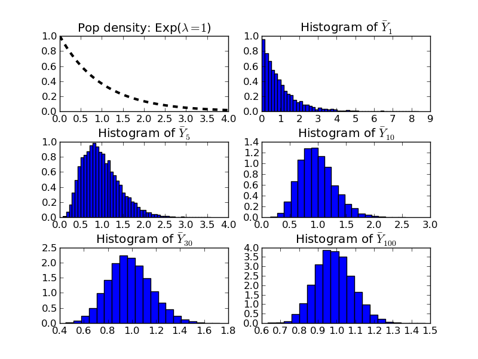
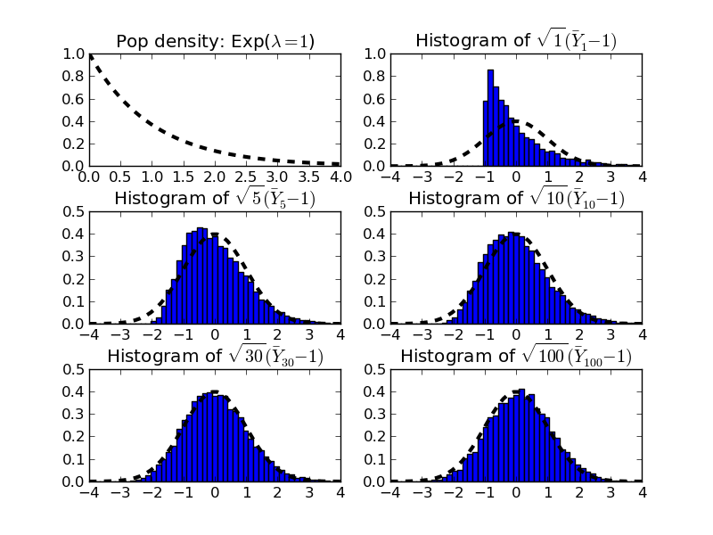

Illustration of Central Limit Theorem using Monte Carlo Simulation
====================================================================

The principal problem in econometrics is that we want to learn something about the unknown
population distribution. For example, we want to know mean heights of Australians. In practice, we
can never know the true population mean; instead we make statistical inferences about the population
mean based on one random sample of size :math:`n` that is drawn from the population. We have learnt
that a good estimator of the population mean is the sample average :math:`\bar{Y}_n`.

We have also learned that the sample average itself is a random variable. If you draw more than one
random sample from the population you are likely to obtain different estimates of the population
mean when computing the sample average. The central limit theorem helps us understand what the
approximate distribution of the sample average looks like. 

To illustrate the CLT we use **Monte Carlo simulation**. Here is a brief excerpt from Wikipedia
explaining the term::

    "Monte Carlo [Simulations] are a broad class of computational algorithms that rely on repeated
    random sampling to obtain numerical results; typically one runs simulations many times over in order
    to obtain the distribution of an unknown probabilistic entity. The name comes from the resemblance
    of the technique to the act of playing and recording results in a real gambling casino. They are
    often used in physical and mathematical problems and are most useful when it is difficult or
    impossible to obtain a closed-form expression, or infeasible to apply a deterministic algorithm.
    Monte Carlo methods are mainly used in three distinct problem classes: optimization, numerical
    integration and generation of draws from a probability distribution." 
    (excerpt taken on 30 July 2014)

Monte Carlo simulations are run on computers that are able to quickly calculate thousands (millions)
of sample averages for as many different samples. In an MC simulation we pretend to know what the
distribution of :math:`Y_i` in the population is: we generate an artificial population from which we
will draw many many different random samples and we then compute many many different sample averages
(for each of the random samples). We are then able to visualize the distribution of
:math:`\bar{Y}_n` by simply looking at a histogram of the different sample averages.

To be specific, let's assume that the population values :math:`Y_i` are actually exponentially
distributed with :math:`\lambda=1`. (Using the exponential distribution is only an example. We could
choose any statistical distribution here, the CLT would still apply.) If you (vaguely) recall the
properties of the exponential distribution, this implies that the population mean :math:`\mu` is
equal to 1 and the population variance :math:`\sigma^2` is also equal to 1. If we compute one random
sample of size :math:`n`, the CLT would therefore suggest the following approximate distribution:

.. math::
   \bar{Y}_n \sim N(1, 1/n)

In an MC simulation we are in the luxurious position to create an artificial population based on the
exponential distribution of, say, 1,000,000 members. We then draw 10,000 random samples of size
:math:`n` (which can take on the values 1, 5, 10, 30, 100 in the pictures below) from that
population and plot the histogram. As you can see in the plots below, as the sample size increases
from 1 to 100, the distribution resembles more and more that of a normal distribution. 

Next, instead of studying the approximate distribution of :math:`\bar{Y}_n`, we standardize the
distribution and thus study

.. math::
   \frac{\bar{Y}_n - \mu}{\sigma/n} = \frac{\bar{Y}_n - 1}{1/n} \sim N(0,1)

It is then easier to superimpose the pdf of the standard normal distribution which can then be
directly compared to the histograms. The CLT says that the histograms should get closer and closer
to the pdf of the standard normal distribution (the dashed line) as the sample size grows from 1 to
5 to 10 to 30 to 100.

This little MC simulation confirms the CLT and it also shows us that sample sizes do not necessarily
need to be very large for the sample average to have a normal distribution. In practice, a sample
size of 30 seems sufficiently large for that purpose.

I hope you are convinced now that the CLT really 'works'. The question remains, how do we use the
CLT theorem for practical purposes? 
